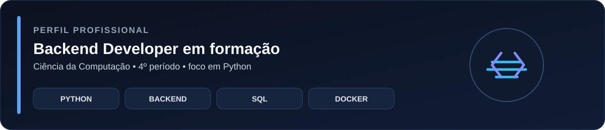

  

---

## 👋 Sobre mim

Sou **Robson Evangelista Dutra**, estudante de **Ciência da Computação (4º período)** e estou construindo minha carreira com foco em **desenvolvimento backend, principalmente com Python**.

Meu objetivo é conquistar minha **primeira oportunidade profissional em tecnologia**, colocando em prática programação, bancos de dados e desenvolvimento de aplicações.

### 🎯 O que estou buscando

- **Backend:** desenvolvimento de aplicações e APIs com Python
- **Dados:** PostgreSQL, MySQL e Pandas
- **Infraestrutura:** Docker, AWS e Linux
- **Próximo passo:** aprofundar conhecimentos em Machine Learning

---

## 🚀 Projetos que mostram minha prática

> Em vez de listar apenas tecnologias, estes são os projetos que melhor mostram como estou aplicando meus estudos.

<table>
<tr>
<td width="50%" valign="top">

### 🐍 [Learning Python](https://github.com/robsondutraa/learning-python)

Repositório de estudos e desafios para consolidar minha base de programação em Python.

**O que pratico**
- lógica de programação
- condicionais e estruturas de repetição
- manipulação de dados
- resolução de problemas

**Tecnologia principal:** Python

</td>
<td width="50%" valign="top">

### 🎲 [Sorteador Mega Sena](https://github.com/robsondutraa/sorteador-mega-sena)

Aplicação em Python que gera jogos da Mega Sena com números únicos, ordenados e dentro das regras do sorteio.

**O que pratico**
- lógica aplicada a um projeto completo
- geração de números aleatórios
- validação de regras
- entrada e saída de dados

**Tecnologia principal:** Python

</td>
</tr>
</table>

---

## 🧰 Stack atual

 

| Área | Tecnologias |
|---|---|
| **Backend** | Python • JavaScript |
| **Banco de dados** | PostgreSQL • MySQL |
| **Dados** | Pandas |
| **DevOps / Infra** | Docker • AWS • Linux |
| **Explorando** | Machine Learning |

---

## 📊 GitHub em números

  

---

## 📈 Como estou evoluindo

**Fundamentos de programação**
&nbsp; → &nbsp;
**Python**
&nbsp; → &nbsp;
**Backend**
&nbsp; → &nbsp;
**Banco de dados**
&nbsp; → &nbsp;
**Projetos práticos**
&nbsp; → &nbsp;
**Primeira oportunidade**

 

Estou usando este perfil como um **portfólio vivo**: cada novo projeto deve demonstrar uma habilidade que estou desenvolvendo, e não apenas adicionar mais uma tecnologia à lista.

---

## 🤝 Vamos conversar?

Estou aberto a **estágios, oportunidades júnior e projetos** que me permitam crescer como desenvolvedor backend.

 

**Construindo experiência através de projetos. 🚀**

